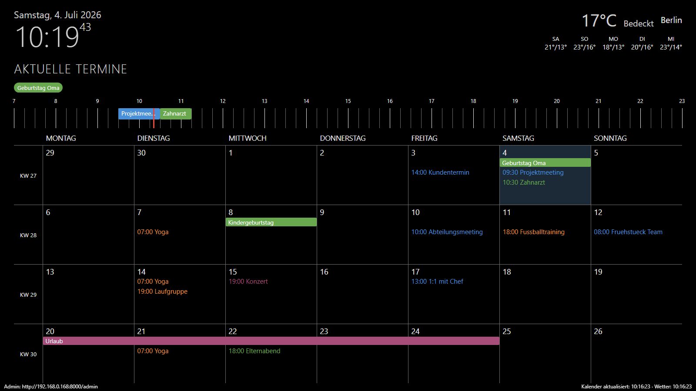

# Deskander

Eigenes Dashboard für einen Raspberry Pi mit angeschlossenem Bildschirm - gedacht als Ersatz für MagicMirror. Zeigt Uhrzeit/Datum, eine Wettervorhersage, eine horizontale Zeitleiste mit den heutigen Terminen und einen Monatskalender über mehrere Wochen. Alle Kalenderquellen, der Wetter-Ort und die Anzeige-Einstellungen werden über ein Web-Admin-GUI im selben Netzwerk konfiguriert - ohne Code-Änderungen und ohne Tastatur/Maus am Pi.



*(Beispieldaten - eigene Kalenderquellen und Farben werden im Admin-GUI eingerichtet.)*

## Features

- **Kalender**: mehrere iCal-Quellen gleichzeitig, jede mit eigener Farbe, inkl. wiederkehrender Termine, mit Start- **und** Endzeit.
- **Zeitleiste** für die heutigen Termine (7-23 Uhr, erweitert sich automatisch bei früheren/späteren Terminen), überlappende Termine werden nebeneinander dargestellt. Ein roter, sekündlich mitlaufender Strich zeigt die aktuelle Uhrzeit direkt auf der Zeitleiste.
- **Monatskalender** mit konfigurierbarer Wochenanzahl und optionaler Kalenderwochen-Spalte. Ganztägige (auch mehrtägige) Termine erscheinen als durchgehender Balken oben in den Tageskacheln; Tage mit mehr Terminen, als in eine Kachel passen, scrollen den Rest automatisch durch.
- **Wetter** über [Open-Meteo](https://open-meteo.com/) (kostenlos, kein API-Key nötig), inkl. Ortssuche im Admin-GUI.
- **Admin-GUI** (`/admin`) - von jedem Gerät im selben Netzwerk erreichbar, kein Login nötig. Die Admin-URL unten links im Kiosk lässt sich in den Anzeige-Einstellungen ein-/ausblenden.
- **Update-Panel** (`/admin/update`) - zeigt, ob eine neuere Version verfügbar ist, und installiert sie per Klick.
- **Kiosk-Feinschliff**: Mauscursor bleibt dauerhaft ausgeblendet (labwc `HideCursor`, automatisch per `install.sh` eingerichtet), Kalender-/Wetter-Aktualisierung startet sofort beim Systemstart und versucht es bei einem Fehlschlag (z.B. Netzwerk noch nicht bereit) nach 60 Sekunden erneut statt das ganze Intervall abzuwarten.

## Voraussetzungen

- Ein Raspberry Pi (3, 4 oder 5) mit Bildschirm, microSD-Karte (mind. 16 GB).
- Ein PC mit dem [Raspberry Pi Imager](https://www.raspberrypi.com/software/), um die SD-Karte einzurichten.

### SD-Karte mit dem Raspberry Pi Imager einrichten

1. **Betriebssystem**: "Raspberry Pi OS (other)" → **"Raspberry Pi OS (64-bit)"** (die normale Version **mit Desktop**, nicht "Lite" und nicht "Full"). Lite hat keinen Desktop/Chromium für die Kiosk-Anzeige.
2. **Gerät**: das jeweilige Pi-Modell auswählen.
3. **SD-Karte**: die Zielkarte auswählen.
4. Vor dem Schreiben auf das Zahnrad ("Einstellungen bearbeiten") klicken und setzen:
   - **Hostname**: frei wählbar (z.B. `deskander`) - der Pi ist danach als `<hostname>.local` im Netzwerk erreichbar.
   - **Benutzername + Passwort**: frei wählbar, merken (wird für SSH gebraucht).
   - **WLAN**: eigene SSID/Passwort, Land `DE`.
   - **Zeitzone/Tastatur**: z.B. `Europe/Berlin` / `de`.
   - Im Reiter "Dienste": **SSH aktivieren** (mit Passwort-Authentifizierung).
5. Speichern → Schreiben. Karte in den Pi, Strom anschließen, einige Minuten warten (erster Start dauert).

## Installation

Vom eigenen PC per SSH auf den Pi verbinden (`ssh <benutzername>@<hostname>.local`) und dort:

```
git clone https://github.com/Raphox2001/Deskander.git ~/Deskander
cd ~/Deskander
./install.sh
```

`install.sh` erledigt automatisch:

- virtualenv anlegen, Python-Abhängigkeiten installieren
- den `dashboard-backend`-systemd-Service einrichten (startet automatisch bei jedem Boot)
- eine Chromium-Policy setzen (unterdrückt Übersetzungsleiste/Passwort-Manager-Hinweise im Kiosk)
- den Kiosk-Autostart einrichten (Chromium startet automatisch im Vollbild) - funktioniert automatisch auf dem aktuellen Raspberry Pi OS (labwc/Wayland)
- den Bildschirmschoner deaktivieren, damit der Bildschirm nie abschaltet

Am Ende einmal neu starten:

```
sudo reboot
```

Danach sollte der Bildschirm automatisch die Dashboard-Ansicht zeigen, ganz ohne Login oder manuelle Schritte.

> Läuft der Pi ausnahmsweise noch auf einem älteren X11-Desktop statt labwc/Wayland (unüblich bei einem frischen Image), muss der Kiosk-Autostart stattdessen manuell über eine systemd-User-Unit analog zu `deploy/dashboard-backend.service` für `deploy/kiosk.sh` eingerichtet werden.

## Ersteinrichtung (Kalender & Wetter)

Von einem anderen Gerät im selben Netzwerk (PC, Handy) im Browser öffnen:

```
http://<hostname>.local:8000/admin
```

(Die genaue Adresse steht auch unten links auf dem Kiosk-Bildschirm selbst.)

Dort:

1. **Kalenderquellen** → "+ Neue Quelle": Name, iCal-URL (z.B. aus Google Kalender oder Outlook exportierbar) und eine Farbe eintragen. Die URL wird beim Speichern automatisch getestet.
2. **Wetter**: Ort über die Ortssuche finden oder Koordinaten direkt eingeben.
3. **Anzeige**: Anzahl der Wochen im Kalender, Kalenderwochen-Spalte an/aus, Zeitzone.

Änderungen werden innerhalb weniger Sekunden im Kiosk übernommen.

## Updates

Am einfachsten über das Admin-GUI: **`/admin/update`** → "Nach Updates suchen" → falls verfügbar, "Jetzt aktualisieren". Holt die neueste Version, installiert sie und startet den Dienst neu - der Kiosk-Bildschirm lädt sich danach automatisch neu.

Alternativ manuell per SSH:

```
cd ~/Deskander
git pull
./install.sh
sudo systemctl restart dashboard-backend
```

## Lokale Entwicklung (Windows)

```
python -m venv .venv
.venv\Scripts\pip install -r requirements-dev.txt
.venv\Scripts\python -m uvicorn app.main:app --reload
```

- Kiosk-Ansicht: http://localhost:8000/
- Admin-GUI: http://localhost:8000/admin

Tests: `.venv\Scripts\python -m pytest`

## Hinweis zu den Daten

Jede Installation hat ihre eigene, nicht versionierte `data/settings.json` - Kalenderquellen, Wetter-Ort etc. werden individuell übers Admin-GUI eingerichtet und landen nie im Git-Repo. Mehrere Leute können also unabhängig voneinander denselben Repo-Link nutzen, ohne sich gegenseitig zu beeinflussen.
