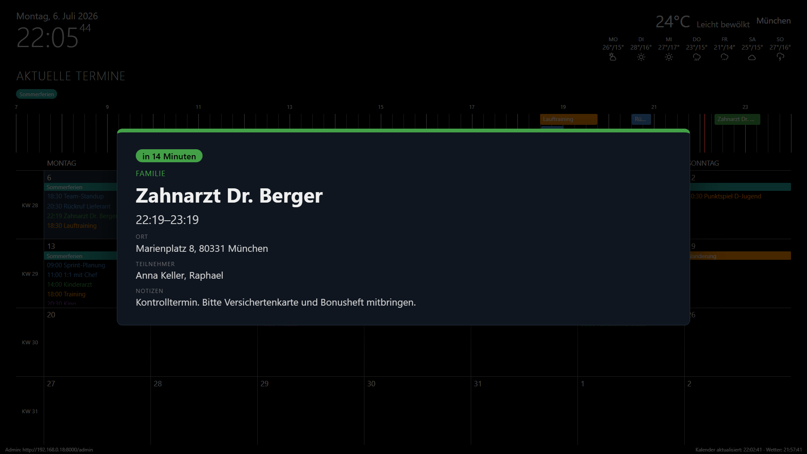
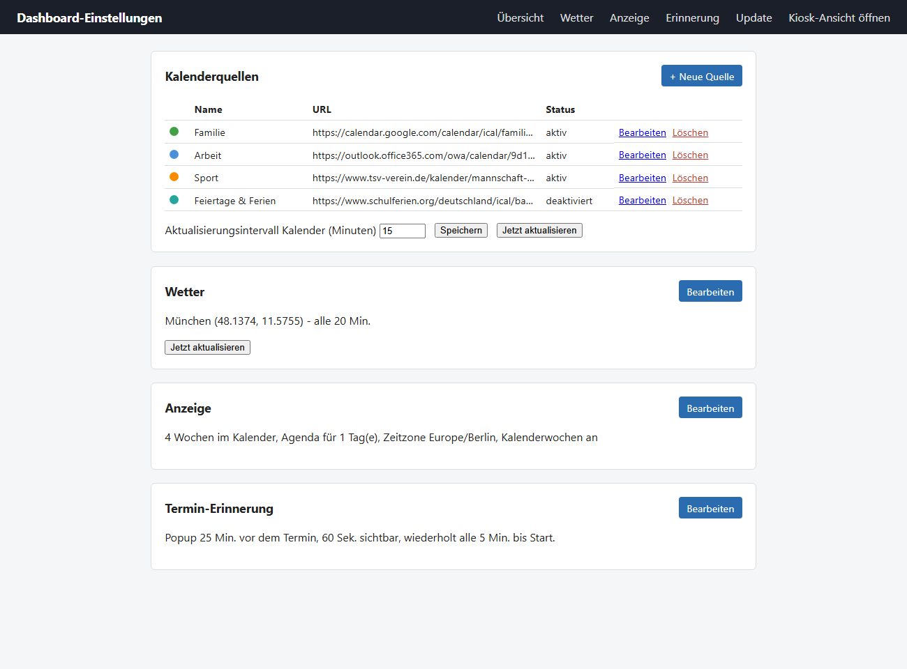
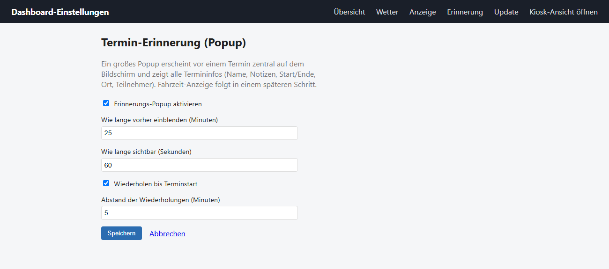

<div align="center">

# 🗓️ Deskander

**Ein selbstgebautes Info-Dashboard für den Raspberry Pi – als eleganter Ersatz für MagicMirror.**

Uhrzeit, Wetter, eine Tages-Zeitleiste und ein Monatskalender aus mehreren iCal-Quellen –
komplett über ein Web-Admin-GUI im Heimnetz konfigurierbar, ganz ohne Tastatur oder Maus am Pi.


<sub>Beispieldaten – eigene Kalenderquellen, Wetterort und Farben werden im Admin-GUI eingerichtet.</sub>

</div>

---

## Inhalt

- [Was ist Deskander?](#was-ist-deskander)
- [Features](#features)
- [Screenshots](#screenshots)
- [Voraussetzungen](#voraussetzungen)
- [SD-Karte mit dem Raspberry Pi Imager einrichten](#sd-karte-mit-dem-raspberry-pi-imager-einrichten)
- [Installation](#installation)
- [Ersteinrichtung (Kalender & Wetter)](#ersteinrichtung-kalender--wetter)
- [Termin-Erinnerung](#termin-erinnerung)
- [Updates](#updates)
- [Wie es funktioniert](#wie-es-funktioniert)
- [Projektstruktur](#projektstruktur)
- [Lokale Entwicklung (Windows)](#lokale-entwicklung-windows)
- [Hinweis zu den Daten](#hinweis-zu-den-daten)
- [Roadmap](#roadmap)

---

## Was ist Deskander?

Deskander verwandelt einen Raspberry Pi mit angeschlossenem Bildschirm in ein immer sichtbares
Familien-Dashboard – die Art Anzeige, die man sich sonst mit [MagicMirror²](https://magicmirror.builders/)
zusammensteckt, hier aber schlanker, in einer einzigen kleinen Python-App und mit einer Bedien­oberfläche,
die man vom Handy oder PC aus im selben WLAN aufruft.

Der Pi zeigt im Vollbild-Kiosk:

- die aktuelle **Uhrzeit und das Datum**,
- eine **Wettervorhersage** für den eingestellten Ort,
- eine **horizontale Zeitleiste** mit den heutigen Terminen,
- einen **Monatskalender** über mehrere Wochen,
- und bei Bedarf ein großes **Erinnerungs-Popup** kurz vor einem Termin.

Alles Weitere – welche Kalender angezeigt werden, welche Farbe sie haben, wo das Wetter herkommt,
wie viele Wochen der Kalender zeigt – stellt man bequem im **Admin-GUI** ein. Der Pi selbst braucht
dafür weder Tastatur noch Maus.

## Features

- 📅 **Mehrere Kalenderquellen** gleichzeitig: beliebig viele iCal-/ICS-URLs (z. B. aus Google Kalender,
  Outlook / Microsoft 365, Apple iCloud oder Nextcloud), jede mit **eigener Farbe**. Wiederkehrende
  Termine werden korrekt aufgelöst, Termine haben Start- **und** Endzeit.
- ⏱️ **Tages-Zeitleiste** für die heutigen Termine (Standard 7–23 Uhr, erweitert sich automatisch bei
  früheren/späteren Terminen). Überlappende Termine liegen nebeneinander, ein **roter, sekündlich
  mitlaufender Strich** markiert die aktuelle Uhrzeit direkt auf der Leiste.
- 🗓️ **Monatskalender** mit konfigurierbarer Wochenanzahl und optionaler **Kalenderwochen-Spalte**.
  Ganztägige (auch mehrtägige) Termine erscheinen als **durchgehender Balken** oben in den Tageskacheln;
  Tage mit mehr Terminen, als in eine Kachel passen, **scrollen den Rest sanft durch**.
- 🌤️ **Wetter** über [Open-Meteo](https://open-meteo.com/) – kostenlos, **ohne API-Key**, inklusive
  Ortssuche im Admin-GUI und Tages-Wettersymbolen.
- 🔔 **Termin-Erinnerung**: ein großes, zentrales Popup erscheint einstellbare Zeit vor einem Termin und
  zeigt Titel, Notizen, Start/Ende, Ort und Teilnehmer. Optional wird es bis zum Terminstart in
  Intervallen wiederholt.
- 🖥️ **Admin-GUI** (`/admin`) – von jedem Gerät im selben Netzwerk erreichbar, kein Login nötig. Die
  Admin-URL unten links im Kiosk lässt sich ein-/ausblenden.
- ⬆️ **Update-Panel** (`/admin/update`) – zeigt, ob eine neuere Version verfügbar ist, und installiert sie
  per Klick; der Kiosk-Bildschirm lädt sich danach automatisch neu.
- 🧰 **Kiosk-Feinschliff**: Mauscursor dauerhaft ausgeblendet, Bildschirmschoner deaktiviert, Chromium-Policy
  gegen Übersetzungsleiste/Passwort-Manager-Nachfragen. Die Kalender-/Wetteraktualisierung startet sofort
  beim Boot und versucht es bei einem Fehlschlag (z. B. Netzwerk noch nicht bereit) nach 60 Sekunden erneut,
  statt das ganze Intervall abzuwarten.
- 🛟 **Robust gegen wackelige Netze**: Der Kiosk liest nur aus einem lokalen Cache – eine langsame oder
  ausgefallene Kalender-/Wetterquelle friert die Anzeige nie ein, sie zeigt einfach die letzten guten Daten.

## Screenshots

**Termin-Erinnerung** – erscheint automatisch kurz vor dem Termin über der Dashboard-Ansicht:



**Admin-GUI – Übersicht** (`/admin`): Kalenderquellen, Wetter, Anzeige und Erinnerung auf einen Blick:



**Admin-GUI – Termin-Erinnerung** (`/admin/reminder`): Vorlaufzeit, Sichtdauer und Wiederholung einstellen:



## Voraussetzungen

- Ein **Raspberry Pi** (3, 4 oder 5) mit Bildschirm und microSD-Karte (mind. 16 GB).
- Ein PC mit dem [Raspberry Pi Imager](https://www.raspberrypi.com/software/), um die SD-Karte einzurichten.
- Ein Netzwerk (WLAN oder LAN), in dem Pi und Konfigurationsgerät (Handy/PC) hängen.

### SD-Karte mit dem Raspberry Pi Imager einrichten

1. **Betriebssystem**: „Raspberry Pi OS (other)“ → **„Raspberry Pi OS (64-bit)“** (die normale Version
   **mit Desktop**, nicht „Lite“ und nicht „Full“). Lite hat keinen Desktop/Chromium für die Kiosk-Anzeige.
2. **Gerät**: das jeweilige Pi-Modell auswählen.
3. **SD-Karte**: die Zielkarte auswählen.
4. Vor dem Schreiben auf das Zahnrad („Einstellungen bearbeiten“) klicken und setzen:
   - **Hostname**: frei wählbar (z. B. `deskander`) – der Pi ist danach als `<hostname>.local` im Netzwerk erreichbar.
   - **Benutzername + Passwort**: frei wählbar, merken (wird für SSH gebraucht).
   - **WLAN**: eigene SSID/Passwort, Land `DE`.
   - **Zeitzone/Tastatur**: z. B. `Europe/Berlin` / `de`.
   - Im Reiter „Dienste“: **SSH aktivieren** (mit Passwort-Authentifizierung).
5. Speichern → Schreiben. Karte in den Pi, Strom anschließen, einige Minuten warten (erster Start dauert).

## Installation

Vom eigenen PC per SSH auf den Pi verbinden (`ssh <benutzername>@<hostname>.local`) und dort:

```bash
git clone https://github.com/Raphox2001/Deskander.git ~/Deskander
cd ~/Deskander
./install.sh
```

`install.sh` erledigt automatisch:

- virtualenv anlegen, Python-Abhängigkeiten installieren
- den `dashboard-backend`-systemd-Service einrichten (startet automatisch bei jedem Boot)
- eine Chromium-Policy setzen (unterdrückt Übersetzungsleiste/Passwort-Manager-Hinweise im Kiosk)
- den Kiosk-Autostart einrichten (Chromium startet automatisch im Vollbild) – funktioniert automatisch auf
  dem aktuellen Raspberry Pi OS (labwc/Wayland)
- den Bildschirmschoner deaktivieren, damit der Bildschirm nie abschaltet

Am Ende einmal neu starten:

```bash
sudo reboot
```

Danach zeigt der Bildschirm automatisch die Dashboard-Ansicht – ganz ohne Login oder manuelle Schritte.

> **Hinweis:** Läuft der Pi ausnahmsweise noch auf einem älteren X11-Desktop statt labwc/Wayland (unüblich bei
> einem frischen Image), muss der Kiosk-Autostart stattdessen manuell über eine systemd-User-Unit analog zu
> `deploy/dashboard-backend.service` für `deploy/kiosk.sh` eingerichtet werden.

## Ersteinrichtung (Kalender & Wetter)

Von einem anderen Gerät im selben Netzwerk (PC, Handy) im Browser öffnen:

```
http://<hostname>.local:8000/admin
```

(Die genaue Adresse steht auch unten links auf dem Kiosk-Bildschirm selbst.)

Dort:

1. **Kalenderquellen** → „+ Neue Quelle“: Name, iCal-URL und eine Farbe eintragen. Die URL wird beim
   Speichern automatisch getestet, damit Tippfehler sofort auffallen.
   - *Google Kalender:* Einstellungen → Kalender auswählen → „Geheime Adresse im iCal-Format“.
   - *Outlook / Microsoft 365:* Kalender → Freigeben/Veröffentlichen → ICS-Link.
   - *Apple iCloud / Nextcloud:* öffentlichen bzw. abonnierbaren Kalender-Link (`.ics`) verwenden.
2. **Wetter**: Ort über die Ortssuche finden oder Koordinaten direkt eingeben.
3. **Anzeige**: Anzahl der Wochen im Kalender, Kalenderwochen-Spalte an/aus, Zeitzone, Sichtbarkeit der Admin-URL.

Änderungen werden innerhalb weniger Sekunden im Kiosk übernommen – kein Neustart nötig.

## Termin-Erinnerung

Unter **`/admin/reminder`** lässt sich ein großes Erinnerungs-Popup aktivieren, das eine einstellbare Zeit
vor einem Termin zentral auf dem Bildschirm erscheint und **Titel, Notizen, Start/Ende, Ort und Teilnehmer**
anzeigt. Einstellbar sind:

- **Vorlaufzeit** – wie viele Minuten vor dem Termin das Popup zuerst erscheint,
- **Sichtdauer** – wie lange es jeweils eingeblendet bleibt,
- **Wiederholung** – optional erscheint es bis zum Terminstart in einstellbaren Intervallen erneut.

Das Popup ist standardmäßig **deaktiviert** und wird im Admin-GUI eingeschaltet. Notizen und Teilnehmer
werden aus den `DESCRIPTION`- und `ATTENDEE`-Feldern der iCal-Termine gelesen.

## Updates

Am einfachsten über das Admin-GUI: **`/admin/update`** → „Nach Updates suchen“ → falls verfügbar,
„Jetzt aktualisieren“. Deskander holt die neueste Version, installiert sie und startet den Dienst neu –
der Kiosk-Bildschirm lädt sich danach automatisch neu.

Alternativ manuell per SSH:

```bash
cd ~/Deskander
git pull
./install.sh
sudo systemctl restart dashboard-backend
```

## Wie es funktioniert

```
   iCal-Quellen        Open-Meteo
        │                   │
        ▼                   ▼
┌───────────────────────────────────┐
│  FastAPI-Backend (dashboard-backend│
│  systemd-Service)                  │
│                                    │
│  APScheduler ─► Kalender/Wetter    │
│                 in In-Memory-Cache │
│                                    │
│  /              → Kiosk-Ansicht    │
│  /display/data  → JSON für Kiosk   │
│  /admin         → Konfigurations-  │
│                   oberfläche       │
└───────────────────────────────────┘
        │
        ▼
   Chromium im Vollbild-Kiosk (labwc/Wayland),
   pollt /display/data alle 10 s
```

- **Backend:** [FastAPI](https://fastapi.tiangolo.com/) + Uvicorn, als systemd-Service `dashboard-backend`.
- **Hintergrundjobs:** [APScheduler](https://apscheduler.readthedocs.io/) aktualisiert Kalender und Wetter
  in einem eigenen Rhythmus und legt die Ergebnisse in einem In-Memory-Cache ab. Der Kiosk selbst spricht
  nie direkt mit iCal/Open-Meteo, sondern liest nur diesen Cache – so kann eine langsame externe Quelle die
  Anzeige nicht blockieren.
- **Kalender:** iCal/ICS wird mit [`icalendar`](https://pypi.org/project/icalendar/) geparst und mit
  [`recurring-ical-events`](https://pypi.org/project/recurring-ical-events/) auf konkrete Termine aufgelöst.
- **Frontend:** eine schlanke Kiosk-Seite (reines HTML/CSS/JS, kein Framework), die `/display/data` pollt.
  Uhr, „Jetzt“-Linie und Erinnerungs-Timing laufen clientseitig im Sekundentakt.
- **Selbst-Update:** Ein per-Boot zufällig erzeugter `backend_boot_id` wird bei jedem Poll verglichen; ändert
  er sich (nach einem Neustart/Update), lädt sich die Kiosk-Seite von selbst neu.

## Projektstruktur

```
app/
  main.py               FastAPI-App + Lifespan (startet den Scheduler)
  scheduler.py          APScheduler-Jobs (Kalender, Wetter, Update-Check)
  cache.py              In-Memory-Cache, aus dem der Kiosk liest
  calendar_service.py   iCal laden/parsen, wiederkehrende Termine auflösen, Snapshot bauen
  weather_service.py    Open-Meteo-Abfrage + Ortssuche
  update_service.py     git pull + install.sh + Dienst-Neustart (Selbst-Update)
  models.py             Pydantic-Einstellungsmodelle
  settings_store.py     Laden/Speichern von data/settings.json
  network_info.py       LAN-IP für die angezeigte Admin-URL
  routers/
    display.py          / (Kiosk) und /display/data (JSON)
    admin.py            /admin ... (Konfigurationsoberfläche)
  templates/            Jinja2-Templates (Kiosk + Admin)
  static/               kiosk.css, admin.css, kiosk.js
deploy/
  dashboard-backend.service   systemd-Unit fürs Backend
  kiosk.sh                    Chromium-Kiosk-Start
  chromium-policy.json        Chromium-Enterprise-Policy
  labwc-rc.xml                labwc-Konfiguration (Cursor ausblenden)
install.sh              Ein-Kommando-Installation auf dem Pi
tests/                  pytest-Tests (Kalender, Wetter, Scheduler, Settings, Update)
```

## Lokale Entwicklung (Windows)

```powershell
python -m venv .venv
.venv\Scripts\pip install -r requirements-dev.txt
.venv\Scripts\python -m uvicorn app.main:app --reload
```

- Kiosk-Ansicht: <http://localhost:8000/>
- Admin-GUI: <http://localhost:8000/admin>

Tests laufen mit:

```powershell
.venv\Scripts\python -m pytest
```

## Hinweis zu den Daten

Jede Installation hat ihre eigene, **nicht versionierte** `data/settings.json` – Kalenderquellen,
Wetter-Ort etc. werden individuell übers Admin-GUI eingerichtet und landen nie im Git-Repo. Mehrere Leute
können also unabhängig voneinander denselben Repo-Link nutzen, ohne sich gegenseitig zu beeinflussen.

## Roadmap

- 🚗 **Fahrzeit / „Losfahren um“** im Erinnerungs-Popup: geplant, aber noch offen. Die dafür nötige
  Anbindung an einen Verkehrs-/Routing-Dienst ist noch nicht entschieden – die Felder dafür sind im
  Datenmodell und Popup bereits vorbereitet.
